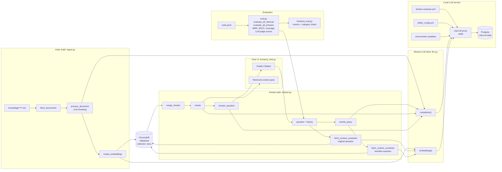

# RAG

## Quickstart

``` shell
cp .env.example .env
docker compose up

uv run ingest.py

uv run frontend_eval.py
uv run frontend_chat.py
```

## Layout

```text
src/rag/
├── docker-compose.yml   # runs LiteLLM proxy on :4000 plus Postgres for LiteLLM state
├── litellm_config.yml   # LiteLLM model aliases, master key, and database settings
├── llm.py               # shared OpenAI-compatible client for completions and embeddings
├── ingest.py            # read knowledge/*.md, LLM-chunk docs, embed chunks, write ChromaDB
├── answer.py            # RAG runtime: rewrite query, retrieve twice, merge, rerank, answer
├── eval.py              # shared evaluation core and CLI for one tests.jsonl row
├── frontend_chat.py     # Gradio chat UI with retrieved-context pane
├── frontend_eval.py     # Gradio evaluation dashboard with metrics and category charts
├── tests.jsonl          # eval questions, keywords, categories, reference answers
├── database/            # generated ChromaDB index, collection "docs"
└── knowledge/           # source markdown docs
    ├── company/
    ├── contracts/
    ├── employees/
    └── products/
```

## Diagram


